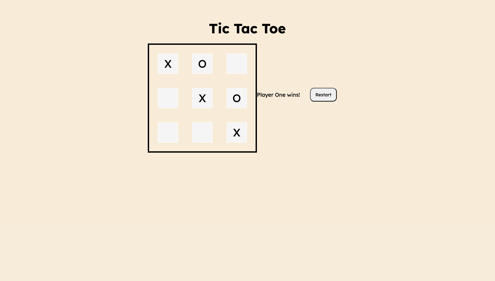

# 👾 Tic Tac Toe 

It is a multiplayer game where you can enter your marker "X" and "O".

Built a Tic Tac Toe game using the module pattern tried tucking in code in factory functions.  

## ✏️ Learnings

- Learned how to use **Factory Functions**, since this projects requires me to build using module pattern.

- Learned how to structure code to minimize global variables and improve reusability.

- It also pushed me to write clean, maintainable, and organized code.

## 🎮 Screenshot 

   

## 🌏 Live Demo

[ View Live  :)](https://gmarav05.github.io/Tic-Tac-Toe/)
 